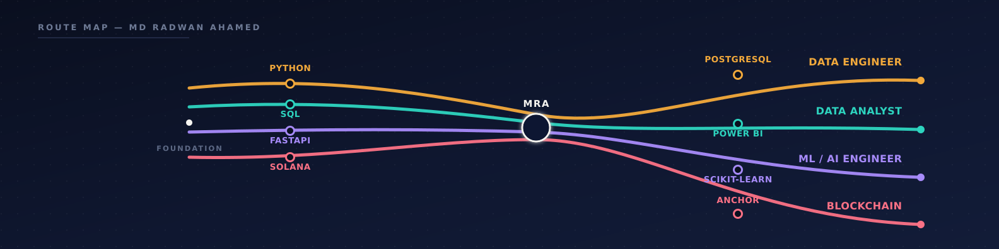

 

 

---

## 👋 Hey, I'm Rupom

I fell into blockchain through curiosity and stayed because it's genuinely hard — the kind of hard where debugging a re-entrancy bug at midnight actually feels satisfying. On the side I've been building ML pipelines, mostly computer vision and RAG systems, which turned out to pair surprisingly well with on-chain data.

Right now I'm at **Betopia Group** shipping a crypto-backed investment platform — audit trails, SQL reporting, the glue work that nobody talks about but everything depends on.

**What I actually do well:**
- Writing Solidity and Rust contracts that hold up under pressure, not just on testnets
- Wiring a full dApp together — wallet auth, payment rails, frontend — without the seams showing
- Getting ML models out of notebooks and into something that serves real traffic
- Building data pipelines that are boring in the best possible way (reliable, observable, no surprises)

Outside work: street photography, gaming when I have the time, music as background to everything else.

**Currently looking for** Blockchain Engineering, AI/ML, or Data Engineering roles — DM me.

 

## ⛓️ Blockchain

> EVM & Solana smart contracts · wallet auth (MetaMask / RainbowKit / Wagmi) · payment rails · upgradeable proxy patterns · full-stack delivery

### [PharmaChain](https://github.com/RupomGg/Pharmachain) — Supply Chain on Ethereum

Pharmaceutical supply chains are a mess — counterfeits, opacity, paper trails that vanish. PharmaChain puts every batch on-chain so it can be independently verified at any point from manufacture to shelf.

The interesting parts: a multi-role RBAC system where manufacturers, distributors, and admins each get their own dashboard; an "Asset DNA" traceability view that maps a batch's full journey with geo-tags and block timestamps; and contracts built on the UUPS upgradeable proxy pattern so the protocol can evolve without nuking existing data.

`Solidity` `Hardhat` `React 19` `Vite` `TailwindCSS` `RainbowKit` `Wagmi` `Viem` `RBAC`

---

### [Nebula Launchpad](https://github.com/RupomGg/Nebula-Launchpad) — Token Launchpad & DeFi Platform

A full-stack launchpad on Sepolia covering the whole token lifecycle — creators launch with custom parameters, investors browse presales, an admin layer watches platform-wide metrics in real time. Upgradeable contracts throughout so the protocol keeps evolving after launch.

`Solidity` `DeFi` `React` `Vite` `Wagmi` `RainbowKit` `Viem` `Recharts` `OpenZeppelin`

---

### 🔒 Aurumchain — KYC-Gated Investment Platform *(Client — NDA)*

Built on **Solana / Anchor + Rust**. KYC-gated tokenized investments with a peer-to-peer secondary market and a custom order-matching engine I'm pretty happy with. Can't share the repo, but happy to walk through the design decisions in a call.

`Solana` `Anchor` `Rust` `Order Matching` `KYC`

 

## 🧠 AI / ML

> Computer vision pipelines · retrieval-augmented generation · GNN-based causal inference · production serving

### [Smart Drone Traffic Analyzer](https://github.com/RupomGg/Smart-Drone-Traffic-Analyzer)

Drone footage → traffic analytics, built as a proper decoupled system rather than a monolithic script. Backend runs YOLO11m + ByteTrack on an A100 via Hugging Face ZeroGPU; the Next.js frontend streams live telemetry in a terminal-style UI.

The part I'm most proud of: a dual-line tripwire system using bounding-box intersection instead of center-points, so long vehicles like buses and articulated trucks get counted correctly instead of being missed or double-counted.

`FastAPI` `YOLO11m` `ByteTrack` `PyTorch` `Next.js` `Docker` `ZeroGPU` `FFmpeg`

 

## 🛠️ Tech Stack

  <table>
    <tr>
      <td align="center" width="25%"><b>Languages</b></td>
      <td align="center" width="25%"><b>Blockchain / Web3</b></td>
      <td align="center" width="25%"><b>AI / ML</b></td>
      <td align="center" width="25%"><b>Backend / Data / Tools</b></td>
    </tr>
    <tr>
      <td align="center" valign="top">
         
         
         
         
         
        
      </td>
      <td align="center" valign="top">
         
         
         
         
         
        
      </td>
      <td align="center" valign="top">
         
         
         
         
         
        
      </td>
      <td align="center" valign="top">
         
         
         
         
         
        
      </td>
    </tr>
  </table>

 

## 📊 GitHub Activity

  

  

 

## 🌐 Languages

| | Language | Level |
|---|---|---|
| 🇧🇩 | Bangla | Native |
| 🇬🇧 | English | Professional |

 

## 📫 Let's Connect

 

*Looking for Blockchain Engineering, AI/ML, or Data Engineering roles — drop me a message.*

